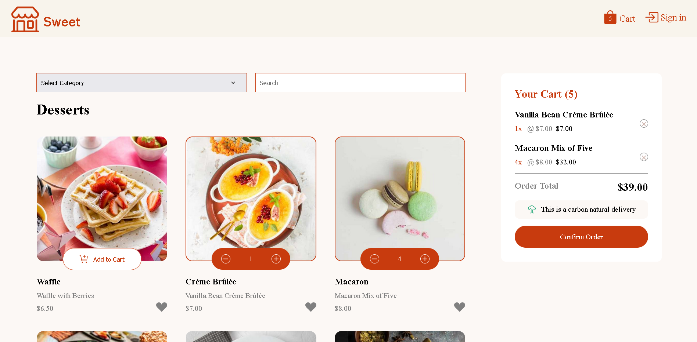
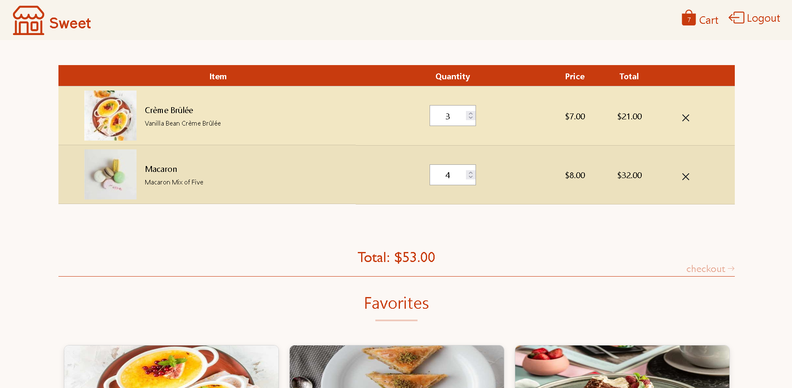

# Products-with-cart

E-commerce shopping cart

## Table of contents

- [Overview](#overview)
- [The challenge](#the-challenge)
- [Screenshot](#screenshot)
- [Links](#links)
- [Built with](#built-with)

## Overview

This project is an e-commerce shopping cart system that allows users to browse a catalog of products, add items to their cart, add items to favorites adjust quantities, and view an order confirmation with a receipt once they checkout.

### The challenge

Users should be able to:

- Add items to the cart and remove them
- Increase/decrease the number of items in the cart
- Add items to favorites
- View the cart and favorites items
- Register/Sign in
- See an order confirmation modal when they click "Confirm Order" or checkout
- Reset their selections when they click "Start New Order"
- View the optimal layout for the interface depending on their device's screen size
- See hover and focus states for all interactive elements on the page

### Screenshot

### Links

- Live Site URL: [Website](https://makhlouf7.github.io/Products-with-cart/)

### Built with

- HTML5
- CSS custom properties
- CSS Positions
- CSS Grid
- JavaScript
- [Bootstrap](https://getbootstrap.com/) - CSS framework
- [jQuery](https://jquery.com/) - JS library
